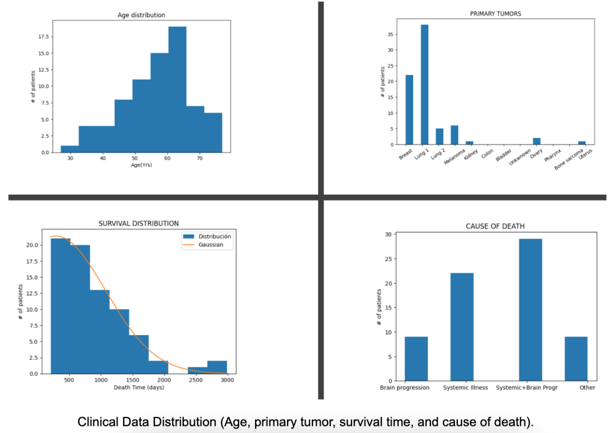
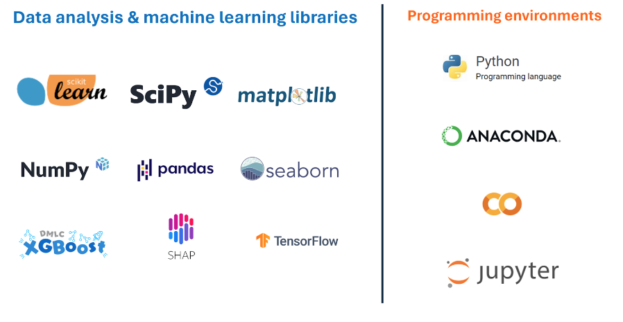

# SaturdaysAI (Asturias) - ML project (Machine Learning on a Brain Metastases Study)


<p align="center">
  
</p>


# Content
- [Project structure](https://github.com/aguadotzn/SaturdaysAI#Project)
- [Team](https://github.com/aguadotzn/SaturdaysAI#Team)
- [Introduction](https://github.com/aguadotzn/SaturdaysAI#Introduction)
- [Objectives](https://github.com/aguadotzn/SaturdaysAI#Objectives)
- [Data](https://github.com/aguadotzn/SaturdaysAI#Data)
- [Technologies/Tools](https://github.com/aguadotzn/SaturdaysAI#Technologies)
- [Acknowledgements](https://github.com/aguadotzn/SaturdaysAI#Acknowledgements)


## Project
```
SaturdaysAI project
│      
└───📁 blog // Posts (in English and Spanish)
│   │   SaturdaysAI-Asturias-Group2-BlogEN.pdf
│   │   SaturdaysAI-Asturias-Group2-BlogES.pdf
└───📁 code // Notebook with all the code
│   │   SaturdaysAI_Asturias_Group2_Objective1.ipynb
│   │   SaturdaysAI_Asturias_Group2_Objective2.ipynb
│   │   SaturdaysAI-Asturias-Group2-FullCode.ipynb
└───📁 data // Datasets
│   │   OpenBTAI_METS_ClinicalData_Nov2023
│   │   OpenBTAI_MORPHOLOGICAL_MEASUREMENTS
│   │   OpenBTAI_RADIOMICS
└───📁 img // Only for README purposes
└───📁 presentation // PPT
│   │   SaturdaysAI-Asturias-Group2-Presentation.ppt
│   │   SaturdaysAI-Asturias-Group2-Presentation.pdf
LICENSE
README
```

### Code
If you want to have a look at the code visit the [/code](https://github.com/aguadotzn/SaturdaysAI/blob/master/code/SaturdaysAI_Asturias_Group2_Code.ipynb) folder. It is actually separated into two different files: objective 1  (`SaturdaysAI_Asturias_Group2_Objective1.ipynb`) and objective 2 (`SaturdaysAI_Asturias_Group2_Objective2.ipynb`). We also upload the full code (`SaturdaysAI_Asturias_Group2_FullCode.ipynb`). We recommend you to open it via colab or locally (with Anaconda).

> ⚠️ We highly recommend you to open directly the code in colab. Direct access [here](https://colab.research.google.com/drive/1O5CIYXvTeAc7FVzzDLyjs4Bz-mFI4KfI?usp=sharing).


## Team
- [Arturo Linares](https://github.com/afouteza) - _arturo.linares@merkle.com_
- [Mateo Rodríguez](http://www.linkedin.com/in/mateo-r-6az) - _mateorsuarez@gmail.com_
- [Olumayowa Onabanjo](https://www.linkedin.com/in/olumayowa-onabanjo-452b8143) - _UO298003@uniovi.es_
- [Raquel Martínez](https://www.linkedin.com/in/rakelmarmar/) - _martinezmraquel@uniovi.es_
- [Adrián Aguado](https://www.aguadotzn.com) - _aagfront@gmail.com_

<p align="center">
  
</p>

  

## Introduction
Cancer has life changing implications and brain metastases are currently one of the hardest to treat. But there is hope, early detection and effective treatment go a long way to ensure patients have the best odds against the disease. 

Brain metastases are cancer cells that spread to the brain from tumors in other organs in the body, which happens in 10% – 35% of adult cancer patients. Estimating prognosis in brain metastasis is clinically relevant, as it allows clinicians to recommend treatments that balance durability of intracranial tumor control with quality of life and side effects of treatment.  In this project we try to make an experiment with machine learning that operates with the [MOLAB](https://molab.es/mathematics-and-brain-metastasis/?idtema=171) data.


## Objectives
One of our goals was to accurately predict how much time is left to savor life. The second goal is just as important, determining when a person is likely to relapse. We’ll run you through our dataset, how we explored the data, decided on an appropriate Machine Learning (ML) approach and our results. 

We divide our work into:
- Predicting **Survival time** - An estimate of the number of days (and possible cause) a patient has left.
- Predicting **patient relapse** - Obtain predictive variables to estimate the recurrence.


| Objectives | Description                                                 |
|------------|-------------------------------------------------------------|
| 1          | Predict survival time in days                               |
| 2 a        | Predict lesion relapse (for all patients)                   |
| 2 b        | Predict lesion relapse (only patients who had radiosurgery) |

<p align="center">
  
</p>


## Data

We worked on the [MOLAB Brain Metastasis Dataset](https://molab.es/datasets-brain-metastasis-1/), a structured and anonymized dataset covering segmented Magnetic Resonance Imaging (MRI) scans, clinical data and morphological measurements of 75 patients.

There are 3 groups of files with structured and unstructured data. You have all the data inside _/data_ folder
- **Clinical data**: an excel spreadsheet with patient data and treatment history.
- **Morphological measures**: an excel file with tumor dimensions and MRI info.
- The **MRI scans** are in formats such as nifti and DICOM.


You can find the main dataset here: [MOLAB Brain Metastasis Dataset](https://molab.es/datasets-brain-metastasis-1/?type=metasrd).

### Data analysis

We have invested most of our time in this phase. A whole lot of plots, graphs and code were needed to understand the relationship between our variables and know what we could predict with the most certainty.

<p align="center">
  
</p>


## Conclusions

1. Our model excelled at predicting survival days, but more data can improve results. Relapse predictions were less accurate due to higher variance, especially in multiclass classifications.
2. The performance varied by task, highlighting the need for testing multiple models to compare outcomes.
3. Despite data limitations, the results are promising, with a 75% accuracy in predicting survival time for 75 patients, though better data and advanced methods are needed for relapse predictions.


## Technologies
  * [Python](https://en.wikipedia.org/wiki/Python_(programming_language))
  * [Google Colab](https://colab.google/)
  * [Jupyter Notebooks](https://jupyter.org/)
  
* Libraries
  * [Pandas](https://pandas.pydata.org/)
  * [Seaborn](https://seaborn.pydata.org/)
  * [Matplotlib](https://matplotlib.org/)
  * [NumPy](https://numpy.org/)
  * [Scipy](https://scipy.org/)
  * [Scikit learn](https://scikit-learn.org/)
  * [Tensor flow](https://www.tensorflow.org/)

<p align="center">
  
</p>

## Acknowledgements 
Thanks to all the [SaturdaysAI](https://saturdays.ai/) team for pushing us during these 16 weeks (from February 2024 to June 2024). Thanks also to [MOLAB](https://molab.es/) (Mathematical Oncology Laboratory) for the fantastic work they are doing.

We achieve our goal with teamwork and a lot of help from our [coordinator](http://linkedin.com/in/sofía-gonzález-arias), instructors, mentors, the [organizers](https://asociacionbigdata.es/) of SaturdaysAI Asturias, our [hosts](https://www.uniovi.es/), and, again, the wonderful people at [MOLAB](https://molab.es/).

## License

This project is licensed under the GNU License - see the [LICENSE](LICENSE) file for details.
Copyright (c) 2024.

