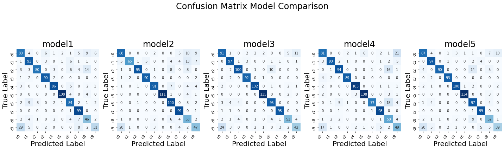

# focusondriving

|  |  | |
|---------------------------------------------|----------|------------|
|    | FOCUS ON DRIVING - SATURDAYS.AI DONOSTIA - 2ª EDICIÓN - JUNIO 2021 ||

# Saturdays.AI

Saturdays.AI es un movimiento comunitario y global, comprometido a promover la educación en Inteligencia Artificial a través de contenido de calidad y el rigor de las mejores universidades.
En resumen, una forma de hacer que esta tecnología sea accesible para todos a través del desarrollo de proyectos con impacto social.

# Equipo: Henry Corazza e Imanol Areizaga
## Objetivo
El objetivo de este proyecto es ajustar un modelo de Deep Learning capaz de identificar y clasificar las diferentes distracciones a que estamos expuestos siempre que conducimos.
Para ello, trabajaremos con una técnica conocida como “Redes Neuronales Convolucionales” (CNN o Convolutional Neural Network).
Probaremos algunas arquitecturas de redes neuronales, todas ellas mejoradas con redes pre-entrenadas para la clasificación de imágenes (transfer learning).

## Conjunto de Imágenes
El conjunto de imágenes que hemos utilizado en el marco de este proyecto proviene de un concurso lanzado en la plataforma Kaggle hace aproximadamente 5 años: 

https://www.kaggle.com/c/state-farm-distracted-driver-detection/overview 

dataset|origen|
|-------|------|
| Train |[kaggle](https://www.kaggle.com/c/state-farm-distracted-driver-detection/data?select=imgs)|
| Test  |[drive](https://drive.google.com/drive/folders/1Me6BfHUGM4JRzmKc4FnlmaYB5Kbs73gc?usp=sharing) - [github](src/img/test)|

Total de 22.424 imágenes, clasificadas en 10 categorías:

|Número de imágenes por categoría | Descripción categoría|
|---------------------------------|----------------------|
|    |  |

# FocusOnDriving.ipynb
Código para generar los modelos.
functions.py --> funciones que se utilizan en el FocusOnDriving.ipynb
Hay que introducir el número de modelo que se quiere entrenar

 [github FocusOnDriving](src/FocusOnDriving.ipynb) 

## Modelos

# FocusOnDriving_compare_models.ipynb
Código para comparar los modelos ajustados. Genera la matriz de confusión de cada modelo.

 [FocusOnDriving_compare_models](src/FocusOnDriving_compare_models.ipynb)

# model_test.ipynb
Código para testear imágenes una a una con los modelos creados. Escribe sobre la imagen la etiqueta y el resultado del modelo y guarda las imágenes. Genera un gif para visualizar el resultado.

 [github model_test](src/model_test.ipynb)

# Resultados
## Comparación de los modelos

|Model|TransferLearning|Accuracy|
|-----|----------------|--------|
|  [model1](https://drive.google.com/file/d/13UQPCI5cHjP8WRA07RmfbkXVrplu3wne/view?usp=sharing)  |     VGG16      | 80.44% |
|  [model2](https://drive.google.com/file/d/1jSfnr8i51t90xX6FHvl1Vd3jAuLsHaMV/view?usp=sharing)  |     VGG16      | 83.73% |
|  [model3](https://drive.google.com/file/d/1x6ACmg7X8QbP6HSbTE1iMnbdythLz9cE/view?usp=sharing)  |     VGG16      | 88.12% |
|  [model4](https://drive.google.com/file/d/1YdAlemOrfsvTm4XR89Kib-kfOT3Nr7by/view?usp=sharing)  |     VGG19      | 84.53% |
|  [model5](https://drive.google.com/file/d/1XTd2epMd6NbRKtYGNoGGq8yi5O2vVjNI/view?usp=sharing)  |     VGG16      | 86.63% |

