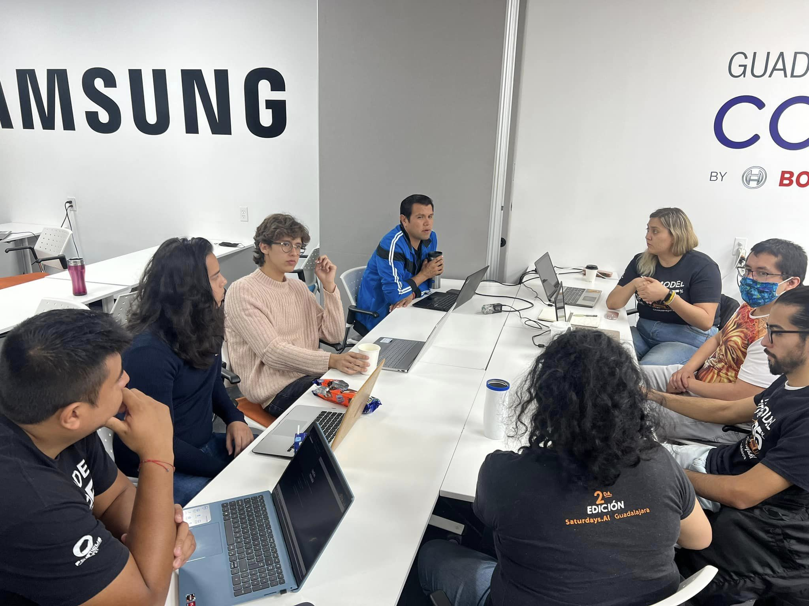

<a name="readme-top"></a>
# Urbalud

<!-- PROJECT LOGO -->
<br />
<div align="center">
  <a href="https://github.com/othneildrew/Best-README-Template">
    
  </a>

  <h3 align="center">Urbalud</h3>

  <p align="center">
    Suficiencia de centros de salud en el territorio de Jalisco
    <br />
    <br />
    <br />
  </p>
</div>

<!-- TABLE OF CONTENTS -->
<details>
  <summary>Tabla de Contenido</summary>
  <ol>
    <li><a href="#about-the-project">About The Project</a></li>
    <li><a href="#Suficiencia-de-centros-de-salud-en-el-territorio-de-Jalisco">Suficiencia de centros de salud en el territorio de Jalisco</a></li>
    <li><a href="#Descripción-del-problema-específico">Descripción del problema específico</a></li>
    <li><a href="#Idea-central-del-proyecto">Idea central del proyecto</a></li>
    <li><a href="#Alcance">Alcance</a></li>
    <li><a href="#Hipótesis">Hipótesis</a></li>
    <li><a href="#Descripción-de-las-fuentes-de-información">Descripción de las fuentes de información</a></li>  
    <li><a href="#Descripción-de-la-solución">Descripción de la solución</a></li>
    <li><a href="#Documentacion-Avanzada">Documentacion Avanzada</a></li>
    <li><a href="#Miembros-de-el-equipo">Miembros de el equipo</a></li>
  </ol>
</details>


<!-- ABOUT THE PROJECT -->
## About The Project

[![Product Name Screen Shot][product-screenshot]](https://sauldev1317-urbalud-app-2hatnf.streamlit.app)

Pagina creada con

* [![streamlit][streamlit.com]][streamlit-url]
* [![Anaconda][Anaconda.com]][Anaconda-url]
* [![Pandas][Pandas.com]][Pandas-url]
* [![Python][Python.com]][Python-url]
* [![Jupyter][Jupyter.com]][Jupyter-url]
* [![Jupyter][NumPy.com]][NumPy-url]

<p align="right">(<a href="#readme-top">back to top</a>)</p>

## Suficiencia de centros de salud en el territorio de Jalisco

Urbalud `Buscando el desarrollo de salud`
Impacto social principal
Acceso a infraestructura para la salud es un derecho básico de la población, generando visibilidad de las necesidades actuales y  las demandas que se pudieran presentar ante una emergencia o futuro cercano.
Impacto hacia los Objetivos de Desarrollo Sostenible (Seleccionar https://www.un.org/sustainabledevelopment/es/objetivos-de-desarrollo-sostenible/)
Alineación a los Objetivos de Desarrollo Sostenible.

* 11 Ciudades y comunidades sostenibles
* 11.1 De aquí a 2030, asegurar el acceso de todas las personas a viviendas y servicios básicos adecuados, seguros y asequibles y mejorar los barrios marginales
* 3 Salud y Bienestar
* 5.8  Lograr la cobertura sanitaria universal, en particular la protección contra los riesgos financieros, el acceso a servicios de salud esenciales de calidad y el acceso a medicamentos y vacunas seguros, eficaces, asequibles y de calidad para todos

## Descripción del problema específico

La falta de servicios de salud de calidad en el Área urbana del estado de Jalisco representa  un desperdicio en materia de capital humano, el cual tiene repercusiones en los diferentes sectores productivos como los son 

<br />

[![Económico][Económico-shield]][Económico-url]
[![Educativo][Educativo-shield]][Educativo-url]
[![Social][Social-shield]][Social-url]

<p align="right">(<a href="#readme-top">back to top</a>)</p>
  
## Idea central del proyecto
El acceso y la asequibilidad  de la población para los servicios de salud por sí solos no son suficientes, para ellos se desarrollará una herramienta de predicción de los  requerimientos de cobertura de atención médica de calidad en los centros de salud  de acuerdo a las tendencias de los diferentes sectores de la  población.

Los protocolos de atención a la población para los diferentes servicios de atención primaria y secundaria como lo son enfermedades  que requieran hospitalización contemplando las hipótesis más catastróficas.
1. Objetivo:
    * Identificar cuántos y cuáles son los servicios necesarios de los centros de salud se requieren al 2030 en el área Metropolitana.
3. Justificación:
    * El crecimiento de la población en áreas urbanas ha aumentado, de acuerdo con lo que establece la Organización de las Naciones Unidas ONU: `El mundo cada vez está más urbanizado. Desde 2007, más de la mitad de la población mundial ha estado viviendo en ciudades, y se espera que dicha cantidad aumente hasta el 60 % para 2030.` (ONU,2015) Por lo que la planeación urbana debe garantizar los servicios básicos para la ciudadanía. 
    * Se ha observado en los últimos años un área de oportunidad para la planificación de servicios médicos de conformidad con las necesidades de la población `Las emergencias sanitarias, como la derivada de la COVID-19, suponen un riesgo mundial y han demostrado que la preparación es vital.` (ONU,2015) Por lo que preveer la demanda de hospitales en corto, mediano y largo plazo.
<p align="right">(<a href="#readme-top">back to top</a>)</p>

## Alcance
La planificación del proyecto abarca el sector público de salud y sector privado. Siendo de manera prioritaria el sector público y sabiendo las limitaciones económicas y técnicas el proyecto genera una oportunidad para desarrollo de proyectos del sector salud, dando en los objetivos claves del proyecto generación de empleos de calidad para servir al sector salud.
<p align="right">(<a href="#readme-top">back to top</a>)</p>

## Hipótesis
De acuerdo a los protocolos reglamentarios para la accesibilidad a la salud y los patrones de natalidad y mortalidad de la población actual se podrá identificar en unidades territoriales los centros de salud necesarios para cubrir la demanda para 2030.

Población específica a la que se dirige el proyecto (describir detalladamente los usuarios. Explicar detalladamente si los usuarios de su  producto/servicio final serán ejecutivos, operativos de áreas específicas de  alguna organización; público en general, sociedad civil; si el acceso a su  producto/servicio será público o restringido y cualquier detalle que  consideren pertinente)

El resultado de la predicción puede ser utilizado por las organizaciones responsables para el desarrollo urbano para vivienda adecuada.
* Organismos Nacionales e Internacionales de Vivienda
* Banco Interamericano de Desarrollo.
* Cámara Nacional de la Industria de Desarrollo y Promoción de Vivienda.
* Comisión Económica para América Latina.
* Cámara Mexicana de la Industria de la Construcción.
* Consejo Nacional de Población.
* Comisión Nacional de Vivienda.
<p align="right">(<a href="#readme-top">back to top</a>)</p>

## Descripción de las fuentes de información 
Las fuentes de alimentación de datos serán extraídas por fuentes oficiales del gobierno como lo son las instituciones de Salud, censos generados por INEGI. Los datos  con los cuales se trabajará son abiertos  
* Directorio Nacional de Unidades Económicas DENUE 
* Instituto Nacional de Estadística y Geografía INEGI
* Proyecciones Comisión Nacional de Población CONAPO

  ```
    https://datos.gob.mx/busca/dataset/proyecciones-de-la-poblacion-de-mexico-y-de-las-entidades-federativas-2016-2050
  ```
* Equipamiento de Salud 
  ```
    https://geoespacial.ruv.org.mx/map 
  ````
  
* Censo de Población  Vivienda 2020.
* Parámetro inicial de normas de SEDESOL (80’s 90’s)
<p align="right">(<a href="#readme-top">back to top</a>)</p>

## Descripción de la solución 

Se planea desarrollar un modelo que prediga según un filtro de años en qué zonas de la mancha urbana se podrían necesitar hospitales y/o centros de salud.
A través del uso de modelos de inteligencia artificial para la predicción que arroje se desplegará en una aplicación web, con el uso de mapas e información clave de   las zonas en dónde se necesitará servicios de salud y atención médica en perdiodos del crecimiento urbano y sectores rurales. 

Cómo producto final quizá se buscaría que haya un filtrado por años e incluso por zona geográfica.

El producto final busca generar un mapa predictivo de la demanda del sector salud, en base al crecimiento de la población, la mancha urbana tanto el sector económico de la población.

<p align="right">(<a href="#readme-top">back to top</a>)</p>

### Documentacion Avanzada

[![Product Name Screen Shot][urbalud-ia-screenshot]](https://medium.com/@fjavier.delatorres/urbalud-ia-que-identifica-si-existe-suficiencia-de-centros-de-salud-en-%C3%A1reas-urbanas-de-jalisco-a7b767f8319c)

<p align="right">(<a href="#readme-top">back to top</a>)</p>

## Acerca de Nosotros

<div align="center">
  <a href="https://github.com/othneildrew/Best-README-Template">
    
  </a>
</div>

<p align="right">(<a href="#readme-top">back to top</a>)</p>

[Streamlit.com]: https://img.shields.io/badge/streamlit-ff4b4b?style=for-the-badge&logo=streamlit&logoColor=white
[Streamlit-url]: https://streamlit.io
[Anaconda.com]: https://img.shields.io/badge/-Anaconda-black.svg?style=for-the-badge&logo=Anaconda&colorB=555
[Anaconda-url]: https://streamlit.io
[Pandas.com]: https://img.shields.io/badge/-pandas-black.svg?style=for-the-badge&logo=pandas&colorB=555
[Pandas-url]: https://streamlit.io
[Python.com]: https://img.shields.io/badge/-Python-black.svg?style=for-the-badge&logo=Python&colorB=555
[Python-url]: https://streamlit.io
[Jupyter.com]: https://img.shields.io/badge/-Jupyter-black.svg?style=for-the-badge&logo=Jupyter&colorB=555
[Jupyter-url]: https://streamlit.io
[NumPy.com]: https://img.shields.io/badge/-NumPy-black.svg?style=for-the-badge&logo=NumPy&colorB=555
[NumPy-url]: https://streamlit.io

[urbalud-ia-screenshot]: images/Urbalud_IA.png

[Económico-shield]: https://img.shields.io/badge/-Econ%C3%B3mico-black.svg?style=for-the-badge&logo=Bitcoin%20SV&colorB=555
[Económico-url]: https://linkedin.com/in/othneildrew
[Educativo-shield]: https://img.shields.io/badge/-Educativo-black.svg?style=for-the-badge&logo=BookStack&colorB=555
[Educativo-url]: https://linkedin.com/in/othneildrew
[Social-shield]: https://img.shields.io/badge/Social-black.svg?style=for-the-badge&logo=Draugiem.lv&colorB=555
[Social-url]: https://linkedin.com/in/othneildrew
