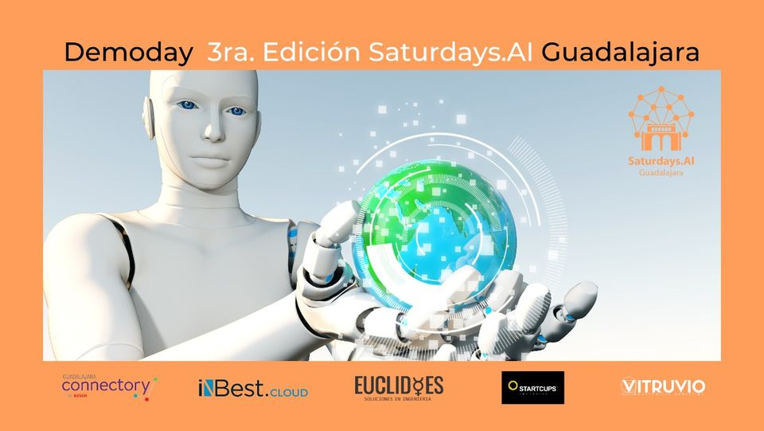

## Class of March 2021 AI Saturdays Guadalajara

1) Health Bot — Equipo Amarillo:
- [Repository, Presentation and Report](https://github.com/YellowTeam/Healt-bot-project)

2) Bienestar.ai — Equipo Dorado:
- [Repository, Presentation and Report](https://github.com/macavimavi/bienestar.ai)

3) Healthcare AI Stocks  — Equipo Verde:
- [Repository, Presentation and Report](https://github.com/jarturoa/Aistocks.git)

4) Moody.ai Emotions Detector - Equipo Rojo:
- [Repository, Presentation and Report](https://github.com/SaturdaysAI/Projects/tree/master/Guadalajara/March2021/EmotionsDetector-main)

