# Tabla de contenidos

**1. Impacto social**

**2. Descripción del problema**

**3. Hipótesis**

**4. Población objetivo**

**5. Descripción de las fuentes de información**

**6. Solución**
        
   **6.1 Creación rest API**

**7. Implementación de brazo robótico**

   **7.1 Materiales**

   **7.2 Diagrama de conexiones**

   **7.3 Espacio de trabajo**

   **7.4 Comentarios código de Python**

   **7.5 Comentarios código de Arduino**

   **7.6 Resultados**
   
**8. Referencias**

**9. Contacto**

# Projecto Saturday AI: Recicla-IA!

Sistema para clasificación de Residuos Sólidos Urbanos

# ¿Cómo usar?
Todo el material necesario para replicar el ejercicio de **Recicla.IA** se encuentra en este proyecto. 

- La base de datos se encuentra en el repositorio mencionado en el apartado 5 de este documento (3 data set : TrashNet, Waste Classification data, Redimensión de Trashnet).
- En la carpeta "Notebook" se encuentran los 3 modelos generados.
- En la  carpeta "rest_api" se encuentra el notebook de cómo se construyó la API.
- En la carpeta "Códigos Brazo Robótico" se encuentran los códigos de Arduino y Python realizados para la integración del sistema con Raspberry Pi y el Brazo Robótico.

Si desea mayor información diríjase al apartado 8 de este documento y no dude en contactarnos.

## Impacto social principal:
Medio ambiente

## Descripción del problema:
En América Latina, debido a la falta de cultura en la separación de los Residuos Sólidos Urbanos (RSU), solamente es posible reciclar el 30% de la basura generada [1].

## Hipótesis:
Al realizar un sistema de fácil implementación que permitiera clasificar de manera correcta los RSU, este representaría la base para la integración de sistemas automáticos de separación de basura, generando un incremento en el porcentaje de basura potencialmente reciclable de hasta el 92% [1].

## Población objetivo: 
Estudiantes y desarrolladores de tecnología interesados en la elaboración de sistemas robóticos que permitan una separación efectiva de RSU.

## Descripción de las fuentes de información:

Para el desarrollo del modelo se consideraron dos fuentes de datos "TrashNet" y "Waste Classication data". Sin embargo, para mejorar la robustez del modelo se redimensionó a una muestra de estas imágenes.

1. TrashNet
    
    a. Fuente definitiva
    
    b. Datos abiertos: https://github.com/garythung/trashnet
  
    c. Set de datos de 2527 imágenes y 6 clasificaciones
      
      1. 501 vidrio
      2. 594 papel
      3. 403 cartón
      4. 482 plástico
      5. 410 metal
      6. 137 Basura
  
    d. Tiene un artículo de investigación anexo: http://cs229.stanford.edu/proj2016/poster/ThungYang-ClassificationOfTrashForRecyclabilityStatus-poster.pdf

2. Kaggle: Waste Classification data
    
    a. Fuente definitiva
    
    b. Datos abiertos: https://www.kaggle.com/techsash/waste-classification-data
    
    c. Set de datos de 22,500 imágenes con dos clasificaciones
        
      1. Orgánico
      2. Inorgánico
    
    d. Tiene Notebooks de referencia relacionados: https://www.kaggle.com/techsash/waste-classification-data/notebooks
 
 3. Dataset utilizado: Fusión de datasets previos
    
    a. Fuente definitiva de unión propia
    
    b. Datos abiertos: https://drive.google.com/drive/folders/1mjJaAUBOka2Z0g7biS1qpLAr9fOEvIzB?usp=sharing
    
    c. Set de datos de 7,000 imágenes con 7 clasificaciones
       
      1. 1,000 vidrio
      2. 1,000 papel
      3. 1,000 cartón
      4. 1,000 plástico
      5. 1,000 metal
      6. 1,000 basura
      7. 1,000 orgánico
    

## Descripción de la solución

Realización de una API desarrollada por medio de Amazon Web Services (AWS), la cual reciba como entrada una imágen de un Residuo Sólido Urbano, y genere como salida la clasificación de dicho residuo, así como su localización en la imágen, de tal manera que permita una fácil implementación en proyectos con sistemas robóticos enfocados en la separación automatizada de basura.
    Así mismo, con respecto al modelo de Machine Learning realizado, se planea que este se base en una arquitectura de Red Neuronal Convolucional, debido a los resultados favorables que estas han presentado en el procesamiento y clasificación de imágenes. Basándonos en el modelo presentado en [2], se planea desarrollar una estructura de Red Neuronal.
    
Finalmente para la implementación final del proyecto, se realizará una integración en un sistema robótico simple, controlado por Arduino y Raspberry Pi, el cual capture imágenes de la basura a separar, la procese generando la solicitud a la API desarrollada, y, dependiendo de la categoría obtenida, haga la separación correspondiente, posicionándolo en el bote adecuado.

## ¿Quiénes podrán utilizarlo?
Cualquier persona con conocimientos suficientes en desarrollo web y uso de APIs, que sean capaces de realizar solicitudes a la API con las imágenes que deseen clasificar, y procesar las respuestas obtenidas.
    Dicho proyecto está enfocado en facilitar el acceso a la población en general a tecnologías de separación automática de basura, esto brindando una herramienta de clasificación accesible por cualquier persona que se encuentre en el desarrollo de un proyecto tecnológico de este tipo, con lo cual se espera reducir la barrera que representa el desarrollo de modelos de Inteligencia Artificial, permitiendo que dichos entusiastas enfoquen sus esfuerzos en la integración del modelo ya entrenado con diversas arquitecturas de sistemas robóticos.
    

# Creación y Configuración REST-API

En esete apartado se indicará cómo dejamos en nuestro caso en producción el sistema de clasificación de basura. La solución es un API rest que recibe la imágen adjunta en el request y retorna una respuesta en JSON con la clasificación obtenida y la probabilidad que el modelo indicó sobre dicha clasificación.

Los pasos que se siguieron para implementar el API son los siguietnes.

 1. Se implenmentó, entrenó y ajustó el modelo con las librerías de TensorFlow Keras para Python.
 2. Se exportó el modelo ya entrenado al formato Protobuf.
 3. Se desplegó el modelo y un EndPoint de inferencia en AWS SageMaker.
 4. Se creó una función Lambda en AWS que recibe una imágen, ejecuta el preprocesado correspondiente, la envía al EndPoint de SageMaker y retorna la respuesta de dicho EndPoint.
 5. Se desplegó un API REST con AWS API Gateway que recibe la imágen adjunta en la solicitud HTTP POST, invoca a la función Lambda y retorna el resultado de la predicción en formato JSON.

   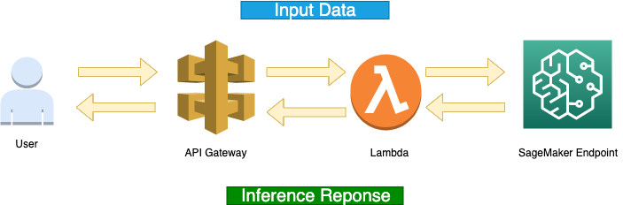 
   
A continuación se indica el procedimiento mdiante el cuál se podrá replicar nuestra API en cualqueir entorno AWS. Cabe destacar qeu también se puede utilizar cualquier parte de la solución por separado.

## Despliegue Endpoint de SageMaker
En esta sección se creará un Endpoint de inferencia de SageMaker en base a un modelo exportado previamente entrenado. La creación se la realizará mediante un Notebook con código Python.

 1. Entrar a la consola de Amazon SageMaker y en el menú Instancias de
    bloc de notas seleccionar la opción Crear instancia de bloc de
    notas.
    
    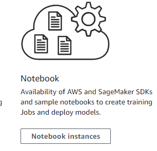 
    
 2. Colocar un nombre representativo y en el campo Tipo de instancia de
    bloc de notas seleccionar la opción ml.t2.medium. Deja el resto de
    configuración con la información que viene por defecto y al final da
    clic en Crear instancia de bloc de notas

    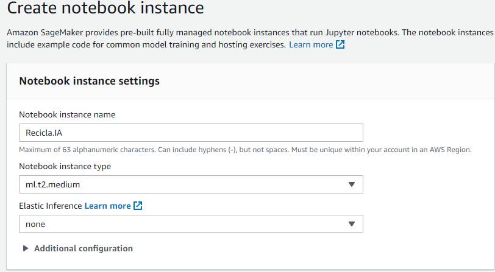

 3. Espera hasta que el estatus cambie a ‘InService’ y abre el Notebook
    en JupyterLab 

    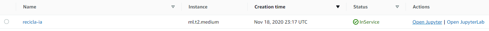

 4. Importar el notebook [deploy_end_point.ipynb](https://github.com/DoradoReciclaAI/Project_recicla_ai/blob/main/rest_api/notebooks/deploy_end_point.ipynb)   que está
        en esta misma carpeta seleccionando el Kernel conda_tensorflow2_p36.
 5. Ejecutar el notebook siguiendo las instrucciones.
 6. En el menú lateral, seleccione la opción Inferencia, Puntos de
    Enlace se debería haber creado un end point nuevo, copie el nombre
    para luego configurar las variables de entorno de la función Lambda.

## Creación Función Lambda

En esta sección se creará la función lambda que recibirá una imágen, realizará el preprocesamiento correspondiente y llamará al Endpoint de inferencia de SageMaker. Luego retornará el resultado de dicha inferencia.

 1. Ingresar a la consola de AWS Lambda y seleccionar la opción Crear
    una función.
    
    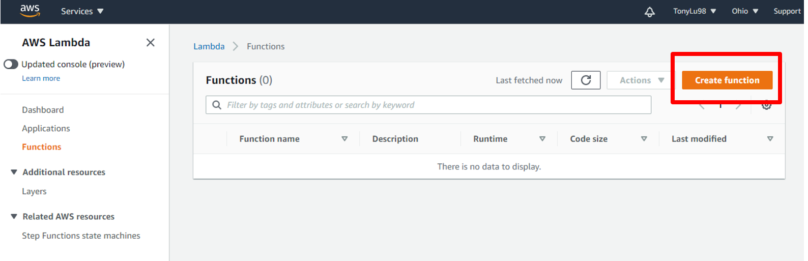 
    
 2. Dentro de la información básica, colocar el nombre y en lenguaje
    seleccionar Python 3.6
    
    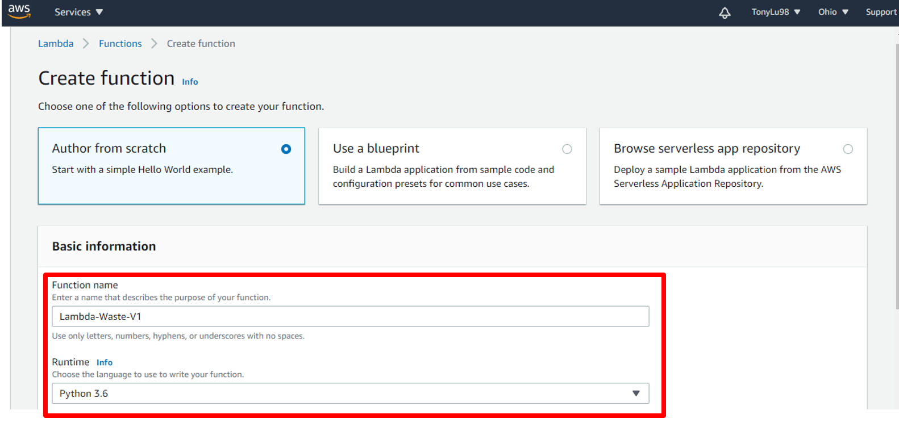 
    
 3. Hacer click en el botón Crear función.
 
    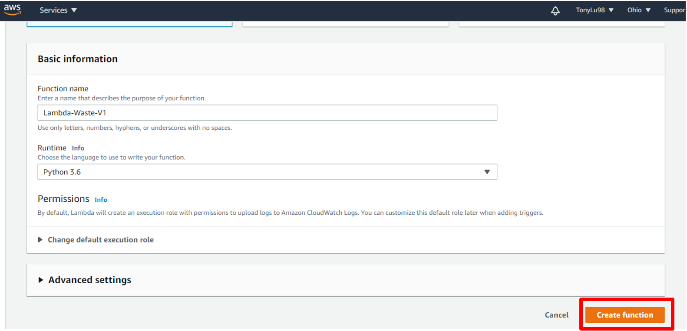 
    
 4. Dentro del combo Acciones, seleccionar la opción Cargar un archivo
    .zip y seleccionar el archivo lambda_function.zip que está en el
    drive.

     
    
 5. En la sección Variables de entorno hacer click en el botón Editar y
    luego en Agregar Variable de Entorno
 6. Agregar una variable con clave ENDPOINT_NAME y cómo valor colocar el
    nombre del enpoint de SageMaker obtenido en el punto 6 de la sección
    anterior.

## Asignación de permisos

En esta sección se asignan los permisos necesarios para que la función Lambda pueda invocar al Endpoint de inferencia.

 1. Ingresar a la consola administrativa IAM e ir a la opción
    Administración del acceso, Roles
 2. Seleccionar el rol asociado a la
    función lambda creada. El nombre del rol comienza con el nombre de
    la función y en el campo Entidades de Confianza dice Servicio de
    AWS: lambda

    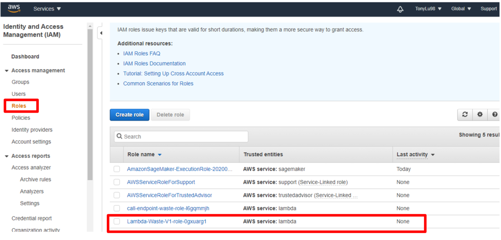 

 3. Seleccionar la opción Añadir una política insertada

    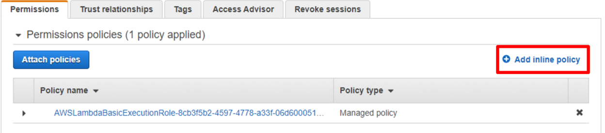 

 4. En servicio seleccionar la opción SageMaker, en acciones seleccionar
    la opción InvokeEndpoint y en Recursos seleccionar Todos los
    recursos

    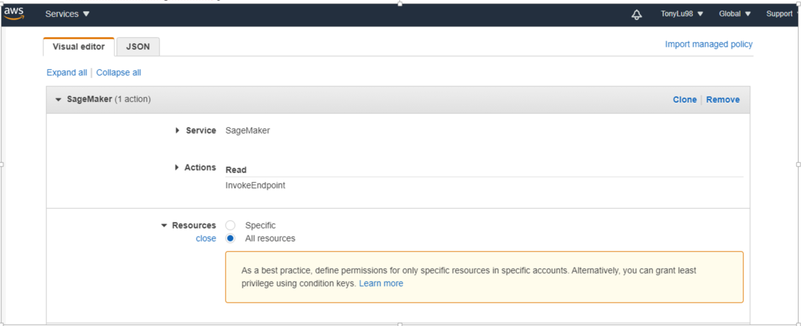 

 5. Hacer click en la opción Revisar la política
 6. Agregar el nombre correspondiente y hacer click en el botón Crear
    una política

    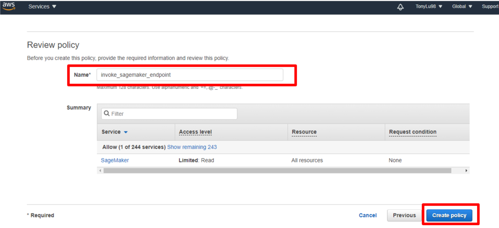 

## Creación Api Gateway
En esta sección se creará el Api Gateway que será el Api REST que recibirá las solicitudes HTTP con la imagen a clasificar y retornará en formato json la clasificación correspondiente y el porcentaje de certeza de dicha clasificaión. 

 1. Ingresar a la consola Api Gateway y seleccionar la opción Crear API.
    Seleccionar la opción Crear del tipo API REST.
 2. Ingresar el nombre elegido y presionar el botón Crear API.

    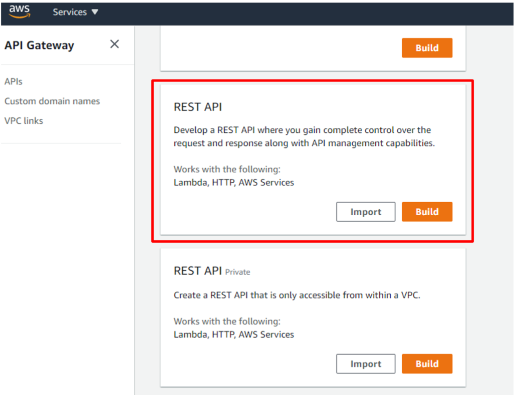 

 3. En el combo Acciones seleccionar la opción Crear	método.

    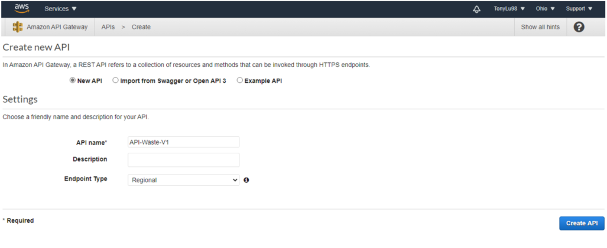 

 4. Seleccionar la opción POST y hacer click en el botón con tilde.

     

 5. En Tipo de integración seleccionar la opción Función Lambda.

    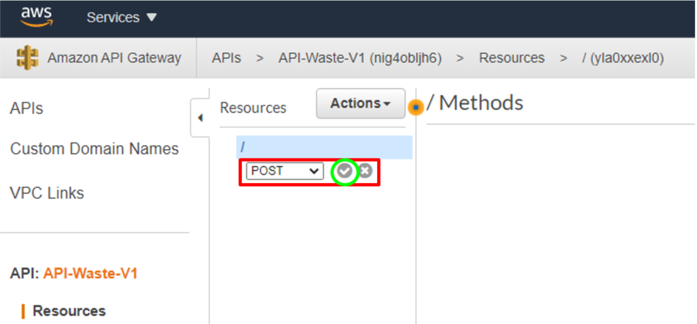 

 6. En el campo Función Lambda elegir la función creada en el paso
    anterior y hacer click en el botón Guardar.
 7. Hacer click en la sección Solicitud de integración y en Plantillas
    de mapeo.

    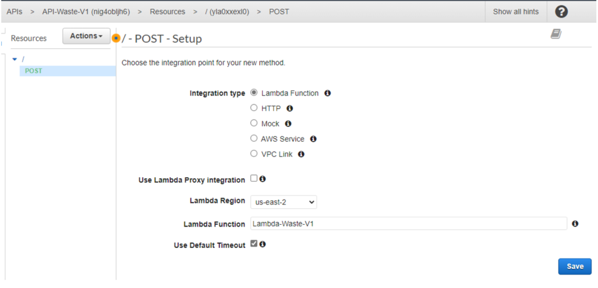 

 8. Hacer click en Agregar Plantilla de mapeo y colocar el Content-Type
    image/jpeg.

    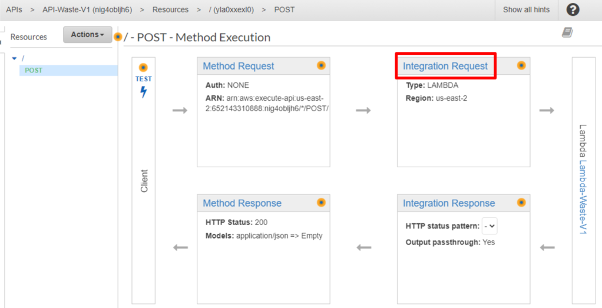 

 9. Al hacer click en el botón con el tilde, aparecerá un popup con un
    alerta, seleccionar la opción No, usar configuración actual.

    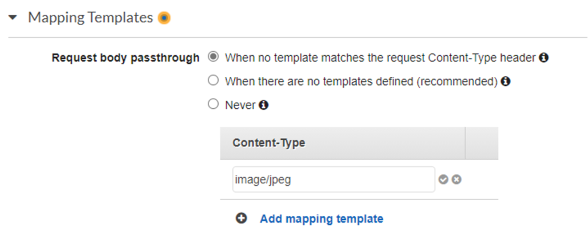 

 10. En el cuerpo de la plantilla agregar el siguiente contenido:

    #set($inputRoot = $input.path('$'))
    {
        "json" : $input.json('$'),
    	"body" : "$util.escapeJavaScript($input.body).replaceAll("\\'", "'")",
    }

   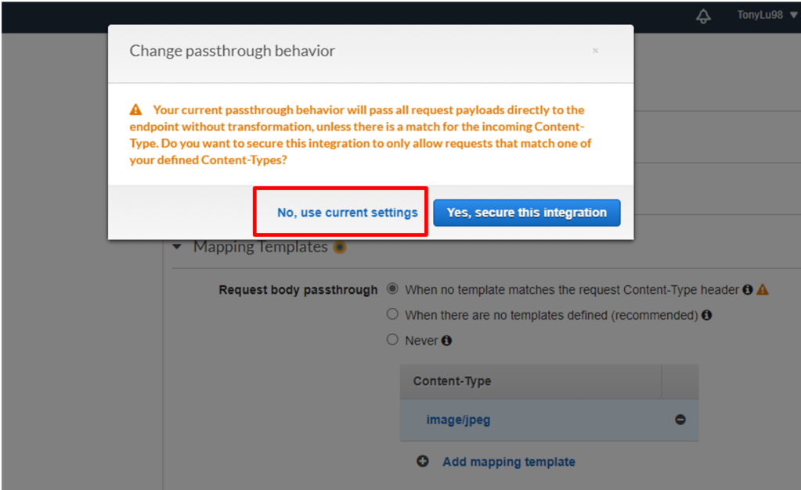 

 11. Seleccionar la opción Configuración del menú izquierdo e ir a la
     sección Tipos de medios binarios.

   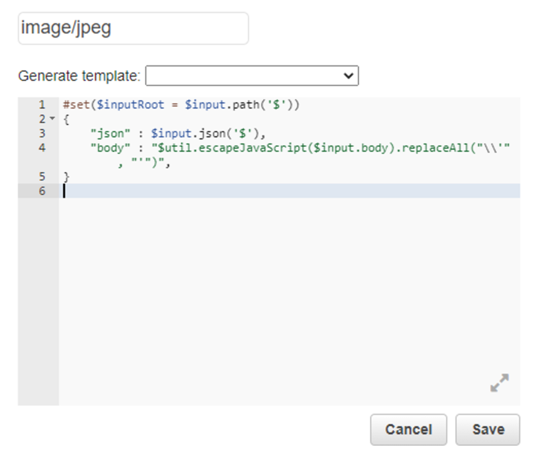 

 12. Hacer click en el botón Agregar tipo de medios binarios y colocar
     el valor image/jpeg.

   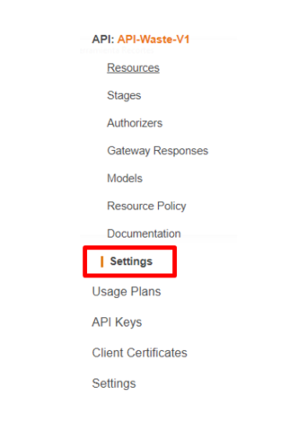 

 13. Seleccionar la opción Recursos del menú izquierdo y en el combo
     Acciones seleccionar la opción Implementar la API.

   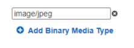 

 14. En el combo Etapa de implementación colocar el nombre que se desee
     y hacer click en el botón Implementación.

   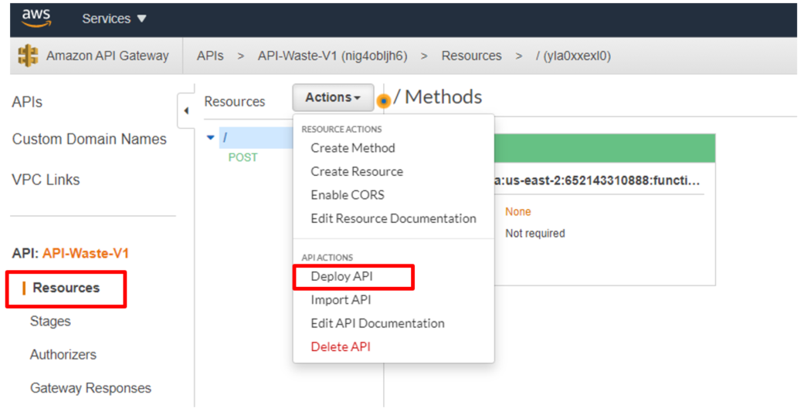 

 15. Con este paso el API REST está desplegada y la url para invocar
     aparece a continuación del texto Invocar URL.

   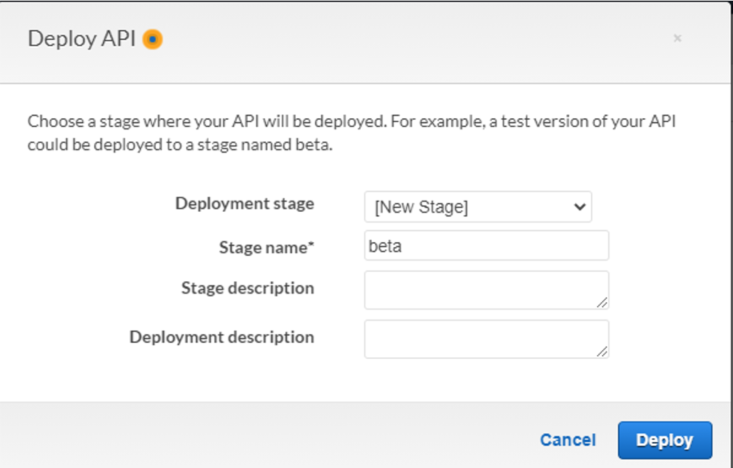 

## Invocación API REST 
En esta sección se indicará el formato del request para invocar el API REST.

 - Protocolo: HTTPS
- Método: POST
- Headers: Content-Type, image/jpeg
- Data-binary: archivo de imágen.

Ejemplo:

    curl --location --request POST 'https://4b4cj4hei4.execute-api.us-east-2.amazonaws.com/beta' \
    --header 'Content-Type: image/jpeg' \
    --data-binary '@/C:/sai/waste-sorting/imagenes/O4.JPG'

# Implementación de brazo robótico
Para la implementación del brazo robótico con el modelo de clasificación de basura, se realizó una integración entre el brazo robótico Braccio de Arduino, encargado de la sujeción del residuo analizado, y un Raspberry Pi 4 conectado a un módulo de visión desarrollado por nosotros, el cual permite la captura de la imágen y su envío correspondiente a partir de un método POST al API Rest explicada previamente. A continuación se presenta un diagrama que resume el sistema en cuestión.

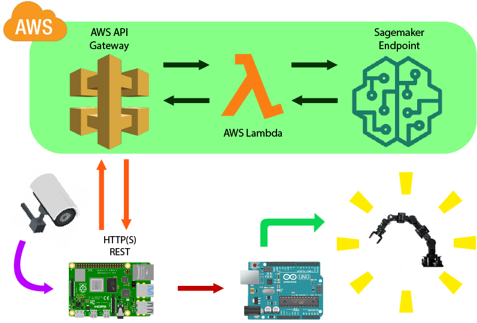 

## Materiales
1. **[Brazo robótico Braccio](https://store.arduino.cc/usa/tinkerkit-braccio)** 
2. **[CanaKit Raspberry Pi 4](https://www.amazon.com/gp/product/B07V5JTMV9/ref=ppx_yo_dt_b_asin_title_o00_s02?ie=UTF8&psc=1)**
3. **[Módulo de cámara Raspberry Pi 5MP](https://www.amazon.com/gp/product/B084X8MZ9J/ref=ppx_yo_dt_b_asin_title_o00_s00?ie=UTF8&psc=1)**
4. **[Arduino UNO REV3](https://store.arduino.cc/usa/arduino-uno-rev3)**

## Diagrama de conexiones
A continuación se presenta el diagrama de conexiones utilizado para el funcionamiento de los códigos presentes en la carpeta de "Códigos Brazo Robótico".

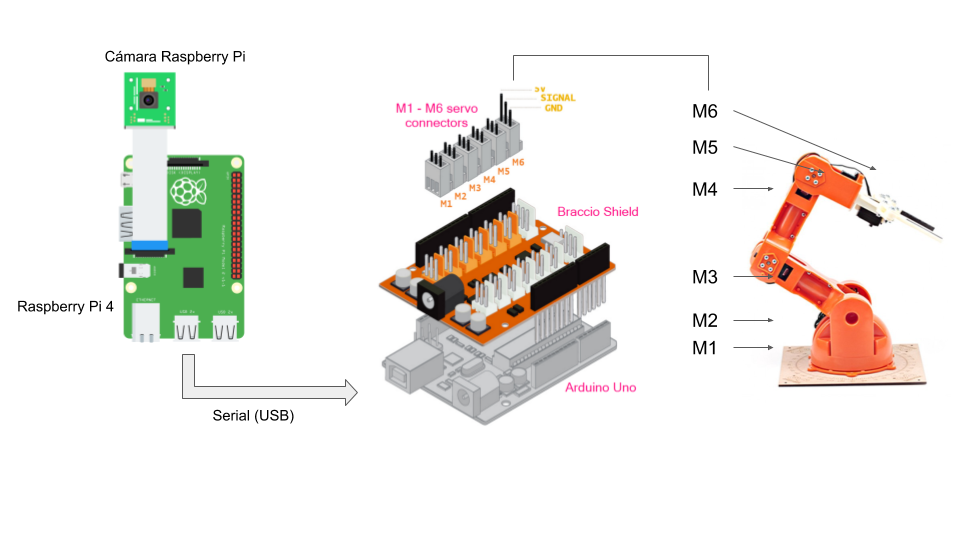 

## Espacio de trabajo
Para la implementación de ejemplo realizada por el equipo, se fijó el brazo robótico, así como el módulo de visión. Cabe resaltar que el módulo de visión consiste únicamente en una caja con interior blanco, dentro de la cual se montó la cámara del Raspberry Pi, de tal manera que se tuviera un ángulo e iluminación constantes para la captura de imágen de los desechos. De igual manera, se colocaron 6 botes para separación de basura, todos dentro del área de alcance máximo del brazo robótico, conjuntando en una sola clase las categorías de papel y cartón. 

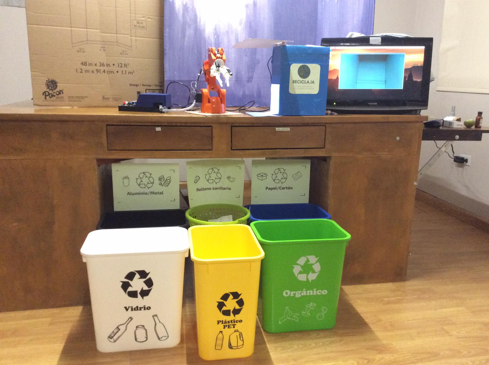 

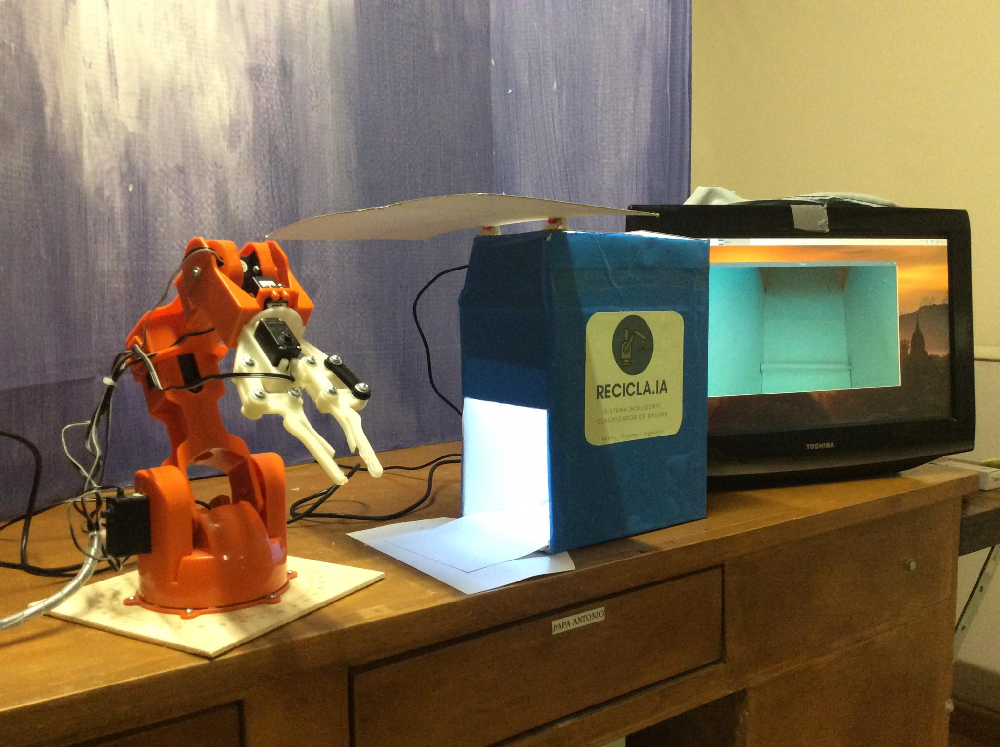 

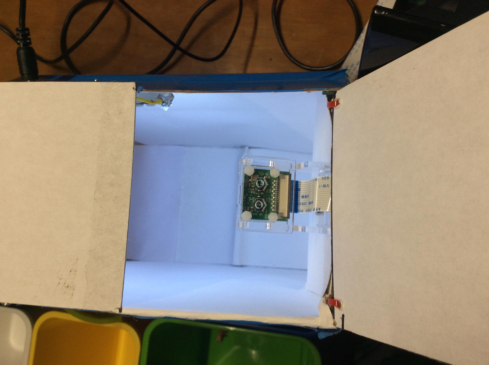 

## Comentarios código de Python (Procesamiento visual y llamado de API)
Dentro del código se presentan dos métodos principales, primeramente el método para detección de objetos a partir de bordes el cual hace uso del método canny() y findEdges() de la librería OpenCV, esto para eliminar el ruido de la imágen de entrada y poder localizar el elemento con el área interna de bordes mayor, siendo en este caso correspondiente para la entrada de un objeto nuevo en el área de visión. De esta manera se genera un recuadro externo al objeto, tanto para visualización hacia el usuario como para recorte de la imágen y hacer un envío más claro al API para su posterior clasificación.

En segundo lugar se tiene el método para envío de imágen a API, el cual toma la imagen previamente recortada del objeto y la envía por medio de una función POST al API Rest, esperando como respuesta la clase y el porcentaje de seguridad en formato JSON. Como comentario adicional, se agregaron indicadores en el código para hacer llamado al API únicamente después de tener un objeto detectado por más de 3 segundos, así como una restricción de no hacer una segunda llamada hasta no existir un cambio de objeto, esto con la finalidad de no hacer llamadas repetitivas e innecesarias al API.

## Comentarios código de Arduino (Brazo robótico)
El código de Arduino elaborado para el control del brazo robótico es relativamente sencillo; Consiste en la espera de la categoría por parte del Raspberry Pi, de esta manera, al recibir una categoría, el brazo ejecuta los movimientos correspondientes para depositar el desecho en el bote correspondiente. Cabe mencionar que los ángulos considerados son específicos del montaje físico con el que se trabajó, por lo cual deberán ser modificados en caso de una implementación diferente.

## Resultados
A continuación se presentan imágenes de la clasificación por parte del Raspberry Pi, así como una secuencia de movimiento del brazo robótico, aunque una demostración completa se puede encontrar en el siguiente video de YouTube. 

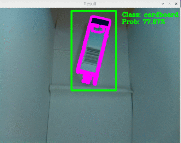 

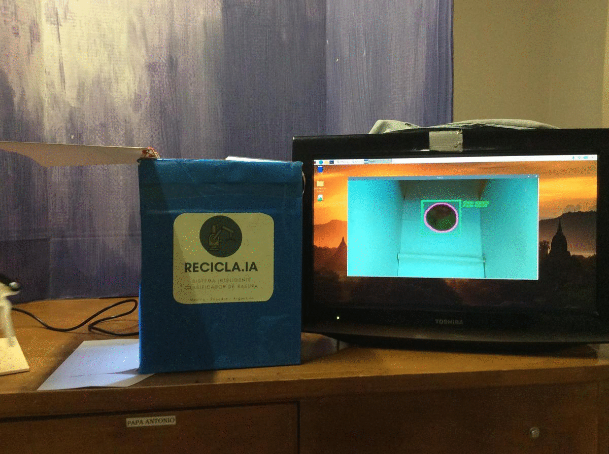 

## Autores

**[Martín Iñigo](https://www.linkedin.com/in/martininigo/)**

**[Andrea Escobar](https://www.linkedin.com/in/amescobar/)**

**[Héctor García](https://github.com/hectorgare)**

**[Aksley Ríos](https://github.com/AksleyRios)**

**[Antonio Luna](https://github.com/TonyLuQ)**

**[Diana López](https://github.com/dipilope)**

**[Jorge Barrera](https://github.com/ivanbrij)**

## Contacto

Correo: recicla_ai@outlook.es

## Referencias
[1] Moyer, E. (2018). Día del Reciclaje: ¿Qué tanto se recicla en América Latina?. [En línea]. Recuperado el 9 de Octubre del 2020 de https://www.nrdc.org/es/experts/erika-moyer/dia-reciclaje-tanto-recicla-america-latina#:~:text=Seg%C3%BAn%20estad%C3%ADsticas%20del%20Banco%20Mundial,menos%20430%2C000%20toneladas%20de%20basura.&text=Si%20la%20basura%20se%20separara,posible%20reciclar%20el%2030%20porciento.

[2] Bircanoğlu, K. et. al. (2018). RecycleNet: Intelligent Waste Sorting Using Deep Neural Networks. Recuperado el 13 de Octubre del 2020 de https://www.researchgate.net/publication/325626219_RecycleNet_Intelligent_Waste_Sorting_Using_Deep_Neural_Networks

