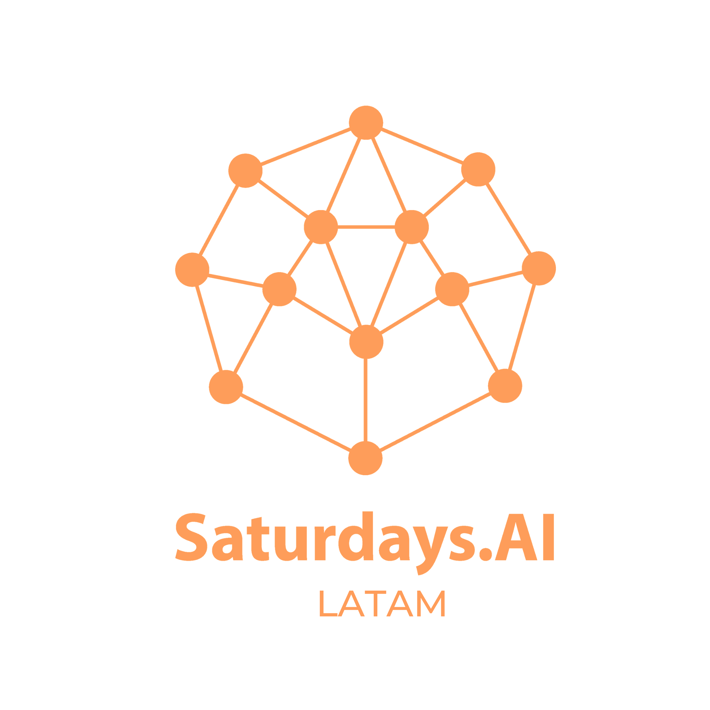
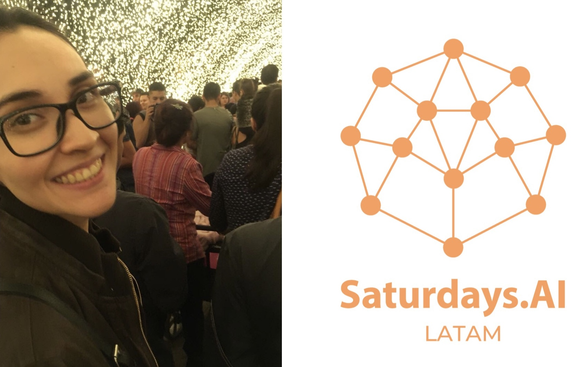

# AI for Secure Driving ( _Safe Driver_ App) : Repositorio

En el siguiente repositorio se encuentran los documentos, datos y _notebooks_ que fueron usados para la realización del proyecto **AI for Secure Driving** realizado como producto final de la **Primera Edición Remota de [Saturdays.AI - LATAM](https://www.saturdays.ai/edicion-latam.html),** organizada por [**Saturdays.AI**](https://www.saturdays.ai/)

## ¿Qué es Saturdays.AI?
Saturdays.AI es una organización con la misión de impulsar a las personas a que aprendan Inteligencia Artificial de manera colaborativa a la par de estar realizando un proyecto de impacto social.

## Equipo Rosa: Miembros y Mentora

**Mentora:**
* [Dra. Lea Vega Romero](https://www.linkedin.com/in/lea-vega-66a18011b/) :mexico: : Maestra y Doctora en Ciencias por el Centro de Investigación y de Estudios Avanzados del Instituto Politécnico Nacional (CINVESTAV), Campus Guadalajara.

**Miembros:**

* [Cristina Higuera](https://www.linkedin.com/in/cristinah03/) :mexico: : Lic Tecnologías de Información, estudiante de Maestría en Informática Aplicada. Se desempeñó como **Product Manager** del proyecto.
* [Isaac Arroyo](https://www.linkedin.com/in/isaac-arroyo/) :mexico: : Estudiante de último año de Ingeniería Física. Desarrolló el papel de **Científico de Datos** estando a cargo de la exploración y visualización de los datos.
* [Rosa Sunum](https://www.linkedin.com/in/rosa-sunum-959033148/) :guatemala: : Bióloga, estudiante de Maestría en Estadística Aplicada. A cargo del rol de **Científica de Datos** y que junto con Marleny Juárez se encargaron del proceso de la selección del modelo de predicción.
* [Marleny Juárez Cayetano](https://www.linkedin.com/in/marleny-ju%C3%A1rez-cayetano-597a371a0/) :mexico: :Ingeniero en Computación. Desarrolladora de software. A cargo del rol de **Ingeniero de Datos** y que junto con Rosa Sunum se encargaron del proceso de la selección del modelo de predicción.
* [Alexander Saravia](https://www.linkedin.com/in/alexander-saravia/) :ecuador: : Ingeniero en Electrónica, Automatización y Control;  Estudiante de Maestría en Inteligencia Computacional y Cofundador de SunPlena Tech (IoT+AI). Desarrolló el papel de **Desarrollador Backend/Model Deployment** estando a cargo de
* [Winter Emmanuel Alava Intriago](https://www.linkedin.com/in/winter-alava/) :ecuador: : Estudiante del último año de Ingeniería Mecatrónica. Desarrolló el papel de **Desarrollador Móvil - UX/UI** estando a cargo de la creación e implementación de la Aplicación móvil **Safe Driver: AI for All**

## Objetivos de Safe Driver
Los accidentes de tránsito parecen ser multidimensionales y aleatorios pero una sola ocurrencia puede llevar a una cadena de eventos catastróficos que van más alla de daños al vehículo, tambien hay vidas humanas en riesgo. Es por eso que con Safe Driver nos vamos aproximando a una solución a esta problemática: Inteligencia Artificial para la predicción de accidentes de tránsito.

## Artículo de Medium
Para saber a detalle el proceso del desarrollo les invitamos a leer los 2 artículos escritos en Medium donde explicamos lo que realizamos junto con las visualizaciones de nuestros resultados:
* [AI for Secure Driving (Pt I)](https://medium.com/saturdays-ai/ai-for-secure-driving-safe-driver-app-parte-i-3fe2ca2955f3)
* [AI for Secure Driving (Pt II)](https://www.medium.com)

(imagenes de los artículos)

## Liberías necesarias

A continuación enlistamos las liberías de Python que usamos durante la realización del proyecto:

* [**NumPy**](https://numpy.org/install/): `pip install numpy`
* [**Pandas**](https://pandas.pydata.org/docs/getting_started/install.html): `pip install pandas`
* [**Matplotlib**](https://matplotlib.org/users/installing.html): `pip install matplotlib`
* [**Seaborn**](https://seaborn.pydata.org/installing.html): `pip install seaborn`
* [**Scikit-learn**](https://scikit-learn.org/stable/install.html): `pip install scikit-learn`
* [**Folium**](https://python-visualization.github.io/folium/installing.html): `pip install folium`
* [**Pickle**](https://docs.python.org/3/library/pickle.html#): `pip install pickle`
* [**Graphviz**](https://graphviz.readthedocs.io/en/stable/): `pip install graphviz`
