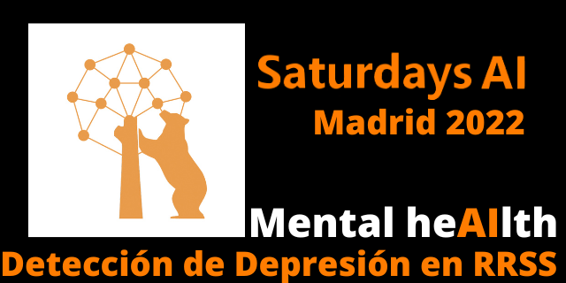

### Utilización de técnicas de Inteligencia Artificial para captar patrones de depresión en redes sociales.

El presente trabajo estudia la manera de detectar en redes sociales los patrones de lenguaje que indiquen que la persona sufre de depresión. Se utiliza como fuente de entrada un fichero con cerca de 3 millones de tweets de unas dos mil personas, que han sido previamente marcadas con una etiqueta que indica si sufren o no de depresión. Este marcado lo han hecho personas expertas en psiquiatria de tal forma que es un indicativo fiable de que el análisis que realicemos puede ser contrastado y verificado. 

### Sobre Saturdays.AI

[**Saturdays AI**](https://saturdays.ai/) es un movimiento comunitario y global dedicado al desarrollo de la educación en Inteligencia Artificial a través de contenido de calidad. El objetivo es que esta tecnología sea accesible para todos a través del desarrollo de proyectos con impacto social.

Este repositorio engloba el proyecto realizado durante la edición de **Saturdays AI 2022 en Madrid**.

### El equipo está formado por:
- Daniel Rodríguez
- Mar Pino
- Raquel Martín
- Victor Barahona

### Y ha sido mentorizado por:
- Teresa García
- David Leirado

**Además de todo el equipo de Saturdays.AI , ¡Gracias!**

### Planificación

Durante seis semanas el equipo ha trabajado en el proyecto siguiendo el siguiente plan de acción:

- **Semanas 1 y 2:** Elección de un dataframe adecuado y limpieza del mismo.
- **Semanas 3 y 4:** Pruebas con el dataframe, elección de algoritmo **Naive Bayes** y ajuste del mismo.
- **Semana 5:** Añadido de segunda opción de análisis con algoritmo de **Transformers**, ajuste del mismo y preparación de documentación para presentación del proyecto en público (**Demo Day**).
- **Semana 6:** Se revisa toda la documentación, últimos ajustes y ensayos de la presentacion final.
- **El Demo Day es el sábado 11 de Junio de 2022.**

 ### Características principales:

El proyecto parte de un conjunto de datos con mas de 3 millones de  tweets de unas dos mil personas que han sido etiquetadas con o sin estado depresivo. Este marcado se ha hecho por personas especialistas por lo que el **dataframe** es fiable.

El proyecto debe limpiar previamente este fichero para poder procesar, es bastante extenso y por ello requiere bastante cálculo. El fichero csv con los datos tabulados no puede adjuntarse aqui por razones de espacio, pesa unos 250mb. Sí se adjuntan los notebooks e información del proceso realizado.

**Fase de limpieza EDA y preparacion de csv limpio y balanceado**

El enlace en Huggingface es este:
[Depresion_Huggingface](https://huggingface.co/datasets/raulminan/depresion-twitter-es/tree/main)

El notebook contenido en esta carpeta adquiere la fuente en Huggingface y la convierte en un csv mas pequeño sin emoticonos ni caracteres especiales, y balanceado de tal forma que haya una cantidad equivalente de tweets con o sin depresion.

- [**LimpiezaEDA**](/LimpiezaEDA/README.md)

**Se han empleado para el análisis los algoritmos NLP siguientes:**

- [**NaiveBayes**](/Naive_Bayes/README.md)
- [**Transformers**](/Transformers/README.md)

### Desarrollo futuro

Se espera continuar con este proyecto a posteriori de la fecha del demo day como vía para profundizar en las técnicas aprendidas, aunque no tenemos por el momento un calendario establecido.

### Licencia:

**GNU General Public License v3.0**

