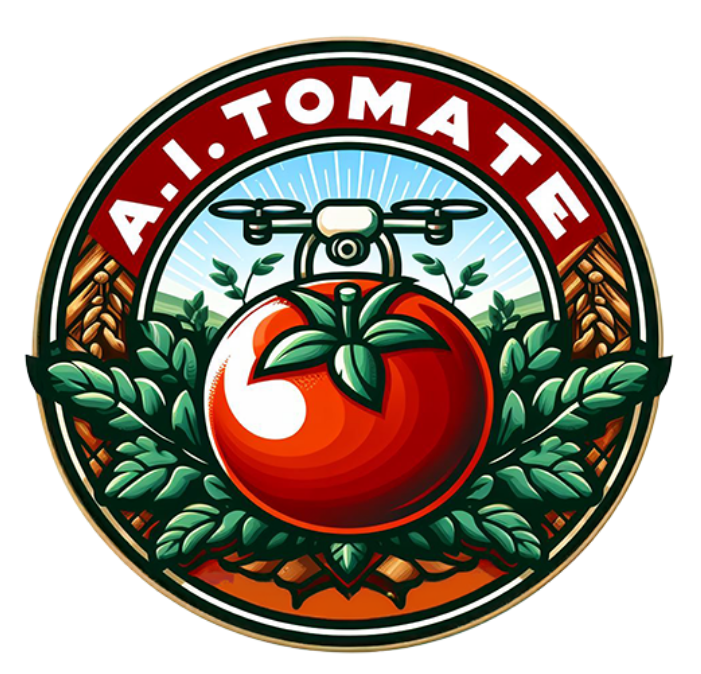

# AI TOMATE - Proyecto de Identificación de Enfermedades en Plantas Tomateras



## Descripción General

**AI TOMATE** es un proyecto que utiliza inteligencia artificial para la identificación temprana de enfermedades en plantas de tomate. Este proyecto se basa en el uso de visión por computadora y técnicas de aprendizaje automático para analizar imágenes de plantas tomateras y diagnosticar posibles enfermedades. El sistema se compone de una aplicación web para la captura de imágenes, una API para el procesamiento de las imágenes y una red neuronal para la detección de enfermedades, ademas incluimos un LLM para ayudar obtener mayor descripcion de la planta afectada.

## Instalación

1. Clona el repositorio:

    ```sh
    git clone https://github.com/FernanMoreno/AITomato.git
    cd tomato
    ```

2. Instala las dependencias:

    ```sh
    pip install -r requirements.txt
    ```

3. Configura Git LFS para manejar archivos grandes:

    ```sh
    git lfs install
    git lfs pull
    ```

4. Instala Ollama y el modelo llava-phi3:

    ```sh
    ollama run llava-phi3
    ```

## Uso

1. Ejecuta la API:

    ```sh
    uvicorn app:app --reload
    ```

2. Captura una imagen con el dron:

    ```sh
    streamlit run capture_streamlit.py
    ```

3. La imagen se enviará automáticamente a la API y el resultado de la detección se mostrará en la webapp.

## Estructura del Proyecto

- `app.py`: API de FastAPI que conecta con el modelo para procesar las imágenes.
- `best_model.weights.h5`: Archivo de pesos del modelo entrenado.
- `resnet50_model.h5`: Archivo del modelo.
- `capture_streamlit.py`: Script de streamlit para poder visualizar las detecciones en las imágenes con el dron.
- `modeloTomates_version2.ipynb`: Notebook de Jupyter con el modelo de detección de enfermedades.
- `llm_multimodal.py`: Ruta de la API al LLM multimodal.
- `model_predict.py`: Ruta de la API al modelo de las predicciones.
- `upload.py`: Ruta de la API para subir las imagenes.
- `dataset-optimizado.zip`: El dataset con el que se entreno el modelo de deteccion de enfermedades.

## Documentación directa de nuestro proyecto:

Puede entender mas sobre nuestro proyecto leyendo la documentación hecha: [AITomate Documentation](https://www.notion.so/Documentaci-n-AITomate-85595b4da73b471ba6943edbed4daa41?pvs=4)

## Contribuciones

Las contribuciones son bienvenidas. Por favor, crea un fork del proyecto y envía un pull request con tus mejoras.


## Contacto

Para preguntas o sugerencias, por favor abre un issue en el repositorio o contacta a fernandojosemolinamore@gmail.com, isaacripoll@gmail.com, susana-aranda@outlook.es, jquijado@gmail.com y victor.arbiol@gmail.com.
