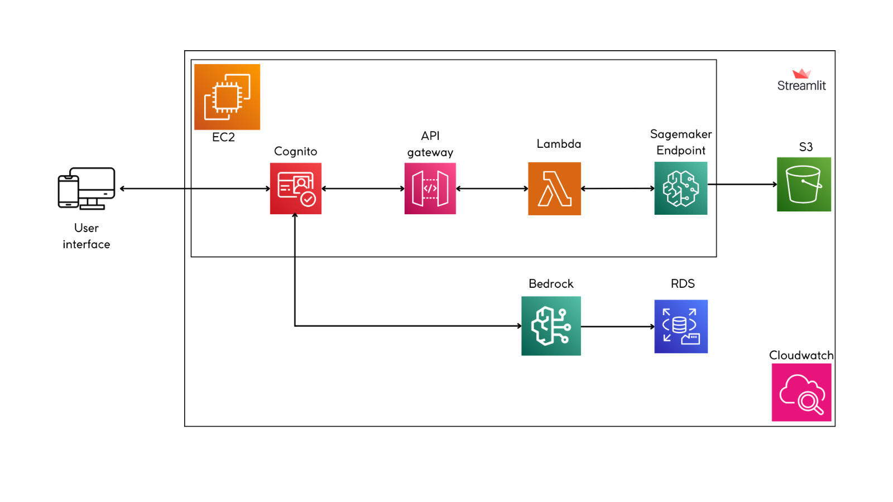

<br>

<!-- </img> -->
<div style="text-align: center;">
  <a href="https://sites.google.com/view/epsilon-data/">Epsilon Data</a>
  <br>
  
</div>

# PREDICCIÓN DE PRECIOS MÍNIMOS PARA REMATES INMOBILIARIOS 

Se muestran los resultados del desarrollo del modelo de predicción automatizado que estime el
valor y la rentabilidad de inmuebles en remate (casas, terrenos,
departamentos) con base en descripciones nuevas, proporcionando
una clasificación precisa de la rentabilidad en categorías de alta,
media o baja para optimizar la toma de decisiones en inversiones
inmobiliarias.


## Endpoints y Login
La contrucción de los modelos se puede encontrar en el siguiente repositorio
<div style="text-align: center;">
  <a href="https://github.com/jeisonchuquin/ml_inmobiliario.git">ml_inmobiliario</a>
  <br>
  <br>
</div>


La página se encuentra en conexión con el endpoint del modelo creado en AWS:

```
    https://uniajfk7o3.execute-api.us-east-1.amazonaws.com/Dev/prediccion
```


El login está bajo la lógica de Cognito de AWS.
<div style="text-align: center;">
  
</div>

## Arquitectura

<div style="text-align: center;">
  
</div>

## Estructura

El proyecto está organizado de la siguiente manera:

- `home_page.py` - El script principal de Python que ejecutas para ver el proyecto.
- `pages/` - Este directorio contiene las distintas páginas del depliegue
- `static/` - Imagenes para el contenido del sitio web.
- `requirements.txt` - Este archivo contiene la lista de paquetes de Python necesarios.


## Instalación

Clonar el repositorio

```bash
https://github.com/danieldiaz5/inmobiliaria.git
```

Abrir una terminal y ejecutar:

```bash
$ python -m venv venv
$ venv\scripts\activate
```

```bash
$ pip install -r requirements.txt
$ streamlit run home_page.py
```


## Contribuidores
- Ivonne Bermeo
- Estefanni Carpio
- Jeyson Chuquin
- Daniel Díaz
- Ana Gabriela Taipe


## Licencia

Streamlit es completamente libre y codigo abierto y bajo licencia de [Apache 2.0](https://www.apache.org/licenses/LICENSE-2.0) .