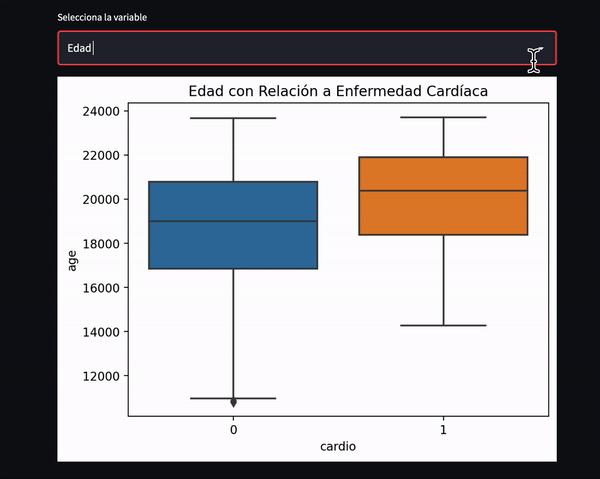
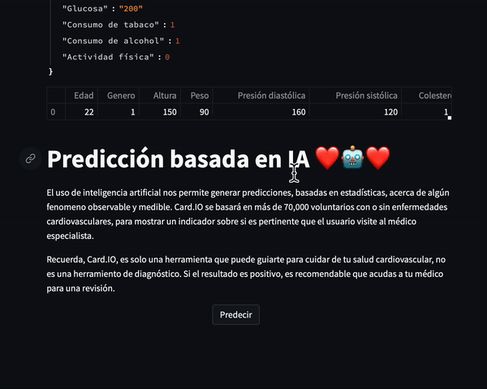
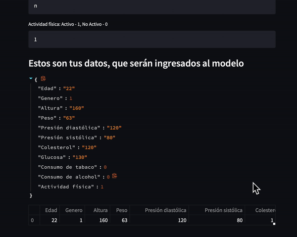

# Saturdays.AI Zaragoza

## README

Card.io – Estimador de enfermedad cardiovascular

## OBJETIVO

Conocer la existencia o no de enfermedad cardiovascular, de una manera rápida, deslocalizada y sin coste.

## DESCRIPCIÓN

Se parte de un conjunto de datos con características de personas y su diagnóstico de la existencia de enfermedad cardiovascular. Mediante algoritmos de inteligencia artificial se entrena y se crea un modelo que predice la enfermedad cardiovascular. El modelo resultante se combina con Streamlit para introducir datos individuales y devuelve la existencia o no de enfermedad cardiovascular.

## DATASET

Obtenido de la página kaggle. El conjunto de datos consta de 70.000 registros de datos de pacientes con 11 características más un objetivo.
Los valores del conjunto de datos se recopilaron en el momento del examen médico, en 2019.
Para ver el fichero hacer click [aquí](https://www.kaggle.com/sulianova/cardiovascular-disease-dataset)

## MODELOS

Se han aplicado modelos de árbol de decisión y random forest, tanto con las variables estándar como variables modificadas para ajustarse más.

Para ver el más detalle de los resultados del proyecto ver el articulo en Medium.com haciendo click [aquí](https://medium.com/@ingenierocesarguayara/card-io-estimador-de-enfermedad-cardiovascular-76919ec753be)

## REQUERIMIENTOS

Se ha utilizado código Python y bibliotecas para análisis, presentación de datos y métricas en entorno:

* COLAB
* Pandas
* Numpy
* Seaborn
* Matplotlib
* Sklearn

Se ha utilizado además **Streamlit** para crear un interfaz de comunicación con el usuario en entorno PyCharm

## PARTICIPANTES

* [Erick René Espíndola](www.linkedin.com/in/erespindola/)
* [César Augusto Guayara](www.linkedin.com/in/cesar-augusto-guayara-lozano-586ba13b/)
* [José Antonio Aísa](www.linkedin.com/in/jos%C3%A9-antonio-a%C3%ADsa-oliver-5aa6b7142/)

## CONCLUSIONES

* Como mayores factores de riesgo se observan la edad, para mayores de 50 años, y una presión arterial alta. También el colesterol y el sobre peso, influyen, caso de ser valores muy altos.

* Se generó un algoritmo de inteligencia artificial capaz de predecir la existencia de enfermedad cardiovascular. Las métricas obtenidas arrojan un valor de accuracy de 0,72.

* Los algoritmos de IA son válidos y fiables para este tipo de diagnóstico médico basado en datos.

## PRÓXIMOS PASOS

Respecto a los datos, conseguir un dataset local, que mejoraría la precisión al enfocarse en una población determinada con hábitos de vida más comunes.
Respecto al código, probar otros algoritmos de machine learning y comparar sus métricas para obtener mejores valores de predicción.

Respecto al interfaz Streamlit, difundirlo entre la población para que se conozca y se tome conciencia del riesgo de padecer enfermedad cardiovascular.
